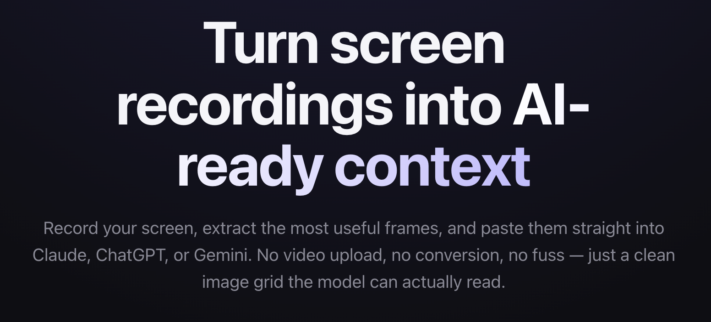

# VideoContext App — Chrome Extension

> Turn screen recordings into AI-ready context. Record your screen, extract the most useful frames, and paste them into Claude, ChatGPT, or Gemini.

Video isn't a supported input in any major LLM today. VideoContext records a portion of your screen, extracts the most useful frames as PNGs, stitches them into a single grid image, and copies that to your clipboard. One paste delivers the whole sequence to the model.

The extension is free and open source (MIT). Find the project at [videocontext.app](https://videocontext.app).

  

---

## Features

- **Tab / Window / Screen capture** via Chrome's native picker.
- **Optional area select** — draw a rectangle to crop every frame.
- **Three duration presets**, all targeting 10 frames:
  - Quick — 5 seconds at 2 fps.
  - Standard — 10 seconds at 1 fps.
  - Slow — 20 seconds at 0.5 fps.
- **3-2-1 countdown** before capture starts.
- **Copy as Grid** — selected frames stitched into one watermarked PNG and written to the clipboard. One paste sends the whole sequence.
- **Save PNGs (zip)** — bulk export selected frames as `frame-001.png`, `frame-002.png`, … inside a single archive.
- **100% offline.** No accounts, no servers, no telemetry. Frames live in browser memory and are dropped when you close the widget.

---

## Install

### From the Chrome Web Store

Listing pending — coming soon.

### From source (unpacked)

1. Clone or download this repo.
2. Open `chrome://extensions` in Chrome.
3. Toggle **Developer mode** on (top right).
4. Click **Load unpacked** and select this folder (the one containing `manifest.json`).
5. Pin the VideoContext icon to your toolbar for one-click access.
